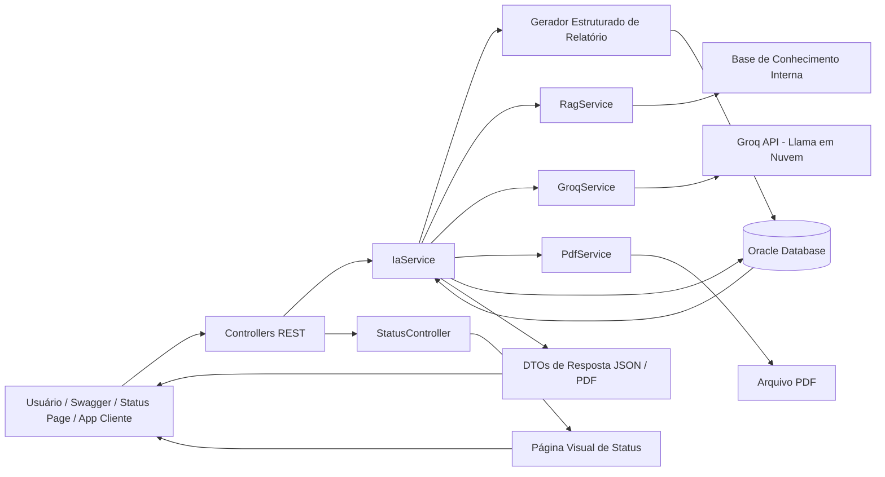
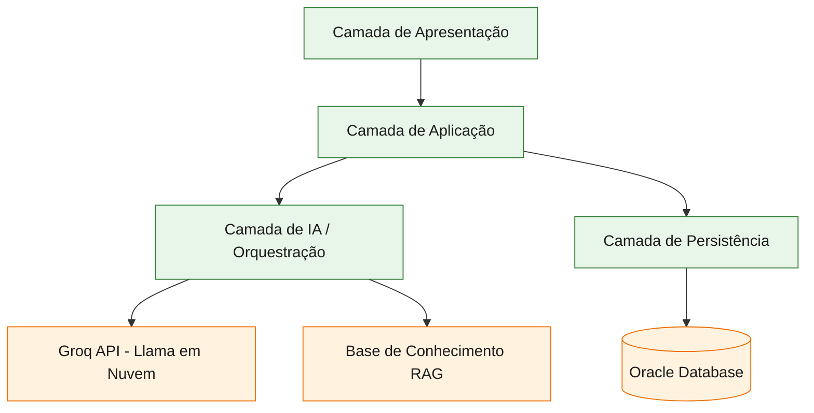
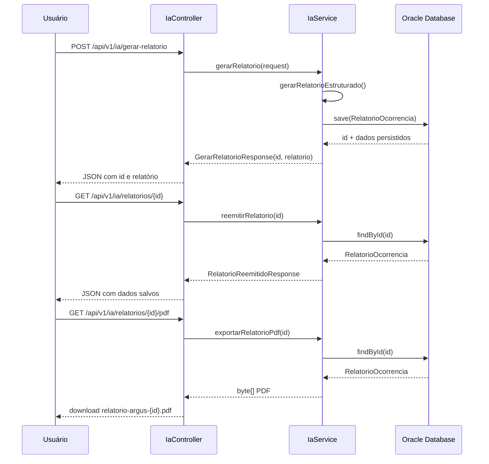
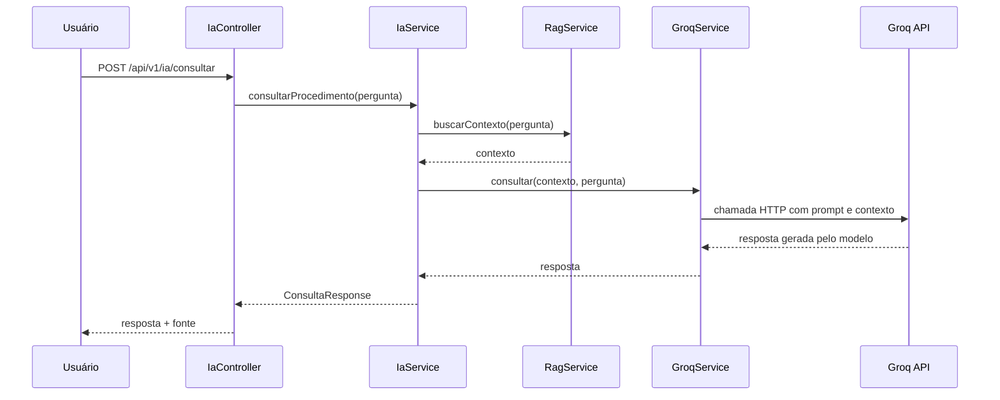

# Argus IA Spring

<p align="center">
  
  
  
  
  
  
  
  
  
</p>

<p align="center">
  <strong>Módulo de Inteligência Artificial do projeto Argus</strong><br/>
  Global Solution 2026/1 · FIAP · Disruptive Architectures: IoT, IoB & Generative IA
</p>

---

## Visão Geral

O **Argus IA Spring** é o módulo de Inteligência Artificial do ecossistema **Argus**, desenvolvido para apoiar brigadistas e coordenadores no **registro de ocorrências ambientais** e na **consulta de procedimentos operacionais**.

A solução foi construída com **Spring Boot**, **Groq API**, **Oracle Database** e **RAG interno**, combinando:

- **IA generativa em nuvem via Groq API** para apoio consultivo;
- **persistência relacional** para armazenar e reemitir relatórios;
- **exportação de relatórios em PDF**;
- **API REST documentada com Swagger**;
- **deploy em Azure Web App com pipeline no Azure DevOps**;
- **base interna RAG ampliada** para respostas contextuais e seguras.

> **Posicionamento do produto:** a IA do Argus **não substitui o brigadista**, não ensina combate ao fogo e não toma decisões críticas em campo. Seu papel é **apoiar documentação, padronização e consulta protocolar**.

---

## Links do Projeto

- **Repositório GitHub:** `https://github.com/DudaAraujo14/argus-ia-spring.git`
- **Swagger UI local:** `http://localhost:8080/swagger-ui/index.html`
- **Health Check local:** `http://localhost:8080/api/v1/ia/health`
- **Status Visual local:** `http://localhost:8080/status`
- **Swagger UI publicado:** `https://argus-ia-spring-eddyerg5dkdqbhba.brazilsouth-01.azurewebsites.net/swagger-ui/index.html`
- **Health Check publicado:** `https://argus-ia-spring-eddyerg5dkdqbhba.brazilsouth-01.azurewebsites.net/api/v1/ia/health`
- **Status Visual publicado:** `https://argus-ia-spring-eddyerg5dkdqbhba.brazilsouth-01.azurewebsites.net/status`
- **Vídeo de Demonstração (YouTube não listado):** ``

---

## Sumário

- [1. Objetivo da Solução](#1-objetivo-da-solução)
- [2. Problema Resolvido](#2-problema-resolvido)
- [3. Funcionalidades Principais](#3-funcionalidades-principais)
- [4. Arquitetura da Solução](#4-arquitetura-da-solução)
- [5. Fluxos de Funcionamento](#5-fluxos-de-funcionamento)
- [6. Tecnologias Utilizadas](#6-tecnologias-utilizadas)
- [7. Estrutura do Projeto](#7-estrutura-do-projeto)
- [8. Endpoints da API](#8-endpoints-da-api)
- [9. Persistência no Oracle Database](#9-persistência-no-oracle-database)
- [10. Como Executar o Projeto](#10-como-executar-o-projeto)
- [11. Configuração da Groq API](#11-configuração-da-groq-api)
- [12. Configuração do Oracle](#12-configuração-do-oracle)
- [13. Prompts e Estratégia de IA](#13-prompts-e-estratégia-de-ia)
- [14. Base de Conhecimento RAG](#14-base-de-conhecimento-rag)
- [15. Evidências de Qualidade](#15-evidências-de-qualidade)
- [16. Limitações Declaradas](#16-limitações-declaradas)
- [17. Evoluções Futuras](#17-evoluções-futuras)
- [18. Critérios Atendidos na Entrega](#18-critérios-atendidos-na-entrega)
- [19. Integrantes](#19-integrantes)

---

## 1. Objetivo da Solução

O objetivo do módulo é entregar uma solução funcional de **IA Generativa aplicada a um problema real**, alinhada ao entregável da disciplina **Disruptive Architectures: IoT, IoB & Generative IA**.

O sistema resolve duas necessidades principais:

1. **Gerar relatórios técnicos padronizados** a partir de dados estruturados de ocorrência.
2. **Responder dúvidas procedimentais** com base em uma base interna de conhecimento, apoiando brigadistas e coordenadores.

Além disso, os relatórios gerados são **persistidos no Oracle Database**, podem ser **reemitidos posteriormente** e também **exportados em PDF** por meio de endpoints específicos.

---

## 2. Problema Resolvido

O brigadista profissional já possui treinamento para atuação em campo. O problema real atacado pela solução não é o combate ao fogo em si, e sim a **sobrecarga documental e burocrática** associada às ocorrências.

### Dor de negócio atendida

- tempo gasto para redigir relatórios formais;
- dificuldade de padronização textual;
- necessidade de consultar procedimentos rapidamente;
- necessidade de recuperar relatórios emitidos anteriormente;
- necessidade de exportar documentos em PDF;
- apoio documental a brigadistas, coordenadores e equipes em rotação entre biomas.

---

## 3. Funcionalidades Principais

### 3.1 Health Check

Verifica se a aplicação está em execução.

```http
GET /api/v1/ia/health
```

---

### 3.1.1 Página Visual de Status

Exibe uma página visual para apresentação do estado da aplicação, com informações sobre backend, IA em nuvem, banco de dados e recursos disponíveis.

```http
GET /status
```

---

### 3.2 Gerar Relatório Técnico

Recebe dados estruturados da ocorrência e gera um relatório técnico formal.

```http
POST /api/v1/ia/gerar-relatorio
```

**Resultado:**
- relatório estruturado;
- persistência no Oracle;
- retorno do `id` do relatório salvo.

---

### 3.3 Reemitir Relatório Salvo

Permite consultar novamente um relatório anteriormente salvo, utilizando o identificador gerado no momento da criação.

```http
GET /api/v1/ia/relatorios/{id}
```

**Resultado:**
- recuperação do relatório salvo no banco;
- retorno dos principais metadados da ocorrência;
- suporte a rastreabilidade documental.

---

### 3.3.1 Exportar Relatório em PDF

Permite baixar um relatório salvo no Oracle em formato PDF, facilitando arquivamento, compartilhamento e apresentação documental.

```http
GET /api/v1/ia/relatorios/{id}/pdf
```

**Resultado:**
- arquivo PDF gerado a partir do relatório salvo;
- download com nome padronizado;
- exportação documental para uso externo.

---

### 3.4 Consultar Procedimentos com IA + RAG

Recebe uma pergunta e utiliza a base interna de conhecimento para recuperar contexto. Em seguida, o contexto é enviado para a **Groq API**, que gera uma resposta orientativa com base nas informações recuperadas.

```http
POST /api/v1/ia/consultar
```

**Resultado:**
- resposta contextual;
- indicação da fonte lógica utilizada;
- apoio documental e procedimental.

---

## 4. Arquitetura da Solução

## 4.1 Visão arquitetural de alto nível



---

## 4.2 Diagrama em camadas



### Interpretação rápida da arquitetura

- **Camada de apresentação:** expõe endpoints REST, documentação Swagger e página visual de status.
- **Camada de aplicação:** coordena os casos de uso da solução.
- **Camada de IA:** integra RAG + Groq API para respostas contextuais.
- **Camada de persistência:** grava e recupera relatórios no Oracle Database.

---

## 4.3 Componentes principais

| Componente | Responsabilidade |
|---|---|
| `HealthController` | Verificação de disponibilidade da API |
| `StatusController` | Página visual de status da aplicação |
| `IaController` | Exposição dos endpoints de IA |
| `IaService` | Orquestra geração, consulta, reemissão e exportação em PDF |
| `RagService` | Recuperação de contexto da base interna |
| `GroqService` | Integração HTTP com a Groq API |
| `PdfService` | Geração de PDF a partir de relatório salvo |
| `RelatorioOcorrenciaRepository` | Persistência e consulta dos relatórios |
| `RelatorioOcorrencia` | Entidade JPA mapeada no Oracle |
| `Groq API` | Serviço de IA generativa em nuvem |
| `Llama via Groq` | Modelo utilizado para geração das respostas consultivas |

---

## 4.4 Diagrama de sequência — geração e reemissão do relatório



---

## 4.5 Diagrama de sequência — consulta com IA + RAG



---

## 5. Fluxos de Funcionamento

### 5.1 Fluxo de geração do relatório

1. O usuário envia dados estruturados da ocorrência.
2. O controller valida o payload.
3. O `IaService` gera o relatório técnico estruturado.
4. O relatório é salvo no Oracle Database.
5. O sistema retorna o `id` e o texto gerado.

### 5.2 Fluxo de reemissão

1. O usuário informa o `id` do relatório.
2. O `IaService` consulta o Oracle.
3. O sistema retorna o relatório persistido e seus dados principais.

### 5.3 Fluxo de exportação em PDF

1. O usuário informa o `id` do relatório salvo.
2. O `IaService` busca o registro no Oracle.
3. O `PdfService` gera o arquivo PDF em memória.
4. O controller retorna o arquivo para download.

### 5.4 Fluxo de página de status

1. O usuário acessa `/status`.
2. O `StatusController` retorna uma página HTML visual.
3. A página apresenta o estado da aplicação, recursos disponíveis e links úteis.

### 5.5 Fluxo de consulta com IA

1. O usuário envia uma pergunta.
2. O `RagService` recupera o contexto da base interna.
3. O `IaService` envia o contexto e a pergunta ao `GroqService`.
4. O `GroqService` chama a Groq API em nuvem.
5. O sistema devolve a resposta orientativa.

---

## 6. Tecnologias Utilizadas

| Tecnologia | Finalidade |
|---|---|
|  | Linguagem principal do backend |
|  | Framework da API REST |
|  | Integração com IA generativa em nuvem |
|  | Modelo utilizado para consulta com IA |
|  | Persistência dos relatórios |
|  | Acesso a dados e mapeamento ORM |
|  | Exportação dos relatórios em PDF |
|  | Documentação e teste da API |
|  | Gerenciamento de dependências |
|  | Controle de versão |
|  | Hospedagem do código |
|  | Hospedagem em nuvem |
|  | Build e deploy automatizados |

---

## 7. Estrutura do Projeto

```txt
src/main/java/br/com/argus/ia
├── controller
│   ├── HealthController.java
│   ├── IaController.java
│   └── StatusController.java
├── dto
│   ├── ConsultaRequest.java
│   ├── ConsultaResponse.java
│   ├── HealthResponse.java
│   ├── GerarRelatorioRequest.java
│   ├── GerarRelatorioResponse.java
│   └── RelatorioReemitidoResponse.java
├── exception
│   ├── ErroResponse.java
│   └── GlobalExceptionHandler.java
├── model
│   └── RelatorioOcorrencia.java
├── rag
│   └── RagService.java
├── repository
│   └── RelatorioOcorrenciaRepository.java
├── service
│   ├── GroqService.java
│   ├── IaService.java
│   └── PdfService.java
└── ArgusIaSpringApplication.java

src/main/resources
└── application.properties
```

---

## 8. Endpoints da API

| Método | Endpoint | Objetivo |
|---|---|---|
| `GET` | `/api/v1/ia/health` | Verificar se a API está disponível |
| `GET` | `/status` | Exibir página visual de status da aplicação |
| `POST` | `/api/v1/ia/gerar-relatorio` | Gerar e salvar relatório técnico |
| `GET` | `/api/v1/ia/relatorios/{id}` | Reemitir relatório salvo no Oracle |
| `GET` | `/api/v1/ia/relatorios/{id}/pdf` | Exportar relatório salvo em PDF |
| `POST` | `/api/v1/ia/consultar` | Consultar procedimentos com IA + RAG |

### Exemplo — gerar relatório

**Request**

```json
{
  "localizacao": "Parque Nacional da Chapada dos Veadeiros - GO",
  "tipoVegetacao": "Cerrado com vegetação seca",
  "tamanhoEstimado": "Aproximadamente 12 hectares",
  "acoesTomadas": "Isolamento preventivo da área, acionamento da Defesa Civil e registro fotográfico da ocorrência",
  "recursosUtilizados": "Viatura de apoio, rádio comunicador, GPS e kit de primeiros socorros",
  "numeroBrigadistas": 8,
  "nivelRisco": "Alto"
}
```

**Response**

```json
{
  "id": 1,
  "relatorio": "RELATÓRIO TÉCNICO DE OCORRÊNCIA - ARGUS..."
}
```

### Exemplo — reemitir relatório

**Request**

```http
GET /api/v1/ia/relatorios/1
```

**Response**

```json
{
  "id": 1,
  "localizacao": "Parque Nacional da Chapada dos Veadeiros - GO",
  "tipoVegetacao": "Cerrado com vegetação seca",
  "tamanhoEstimado": "Aproximadamente 12 hectares",
  "nivelRisco": "Alto",
  "relatorio": "RELATÓRIO TÉCNICO DE OCORRÊNCIA - ARGUS...",
  "criadoEm": "2026-06-01T10:30:00"
}
```

### Exemplo — exportar relatório em PDF

**Request**

```http
GET /api/v1/ia/relatorios/1/pdf
```

**Response**

```txt
Download do arquivo relatorio-argus-1.pdf
```

### Exemplo — página visual de status

```http
GET /status
```

A página visual apresenta status da aplicação, backend, IA em nuvem, banco de dados e links úteis da API.

### Exemplo — consulta de procedimento

**Request**

```json
{
  "pergunta": "Qual procedimento em caso de ocorrência com vítima?"
}
```

**Response**

```json
{
  "resposta": "Em caso de ocorrência com vítima, a equipe deve priorizar a segurança da área, acionar imediatamente o serviço médico de emergência e comunicar a Defesa Civil ou órgão responsável. O relatório deve registrar horário, localização, condição observada e providências tomadas.",
  "fonte": "Base interna de procedimentos Argus + Groq API"
}
```

---

## 9. Persistência no Oracle Database

Os relatórios são gravados no **Oracle Database** por meio de **Spring Data JPA**.

### Entidade persistida

- `RelatorioOcorrencia`

### Tabela principal

- `TB_RELATORIO_OCORRENCIA`

### Campos principais

- `ID_RELATORIO`
- `LOCALIZACAO`
- `TIPO_VEGETACAO`
- `TAMANHO_ESTIMADO`
- `ACOES_TOMADAS`
- `RECURSOS_UTILIZADOS`
- `NUMERO_BRIGADISTAS`
- `NIVEL_RISCO`
- `RELATORIO`
- `CRIADO_EM`

### Vantagem acadêmica e técnica

Essa camada mostra que o projeto não apenas gera a informação, mas também:

- persiste o resultado;
- oferece rastreabilidade;
- permite consulta posterior;
- permite exportação documental em PDF;
- aproxima a solução de um cenário real de uso.

---

## 10. Como Executar o Projeto

### Pré-requisitos

- Java 17
- Maven ou Maven Wrapper
- IntelliJ IDEA Community
- Oracle Database acessível
- Chave da Groq API

### Passos

```bash
# 1. Clonar o repositório
git clone https://github.com/DudaAraujo14/argus-ia-spring.git

# 2. Entrar na pasta do projeto
cd argus-ia-spring

# 3. Configurar as variáveis de ambiente no IntelliJ ou no terminal
# ORACLE_DB_URL, ORACLE_DB_USER, ORACLE_DB_PASSWORD e GROQ_API_KEY

# 4. Executar a aplicação Spring Boot
mvn spring-boot:run
```

Depois, acessar:

- Swagger local: `http://localhost:8080/swagger-ui/index.html`
- Health local: `http://localhost:8080/api/v1/ia/health`
- Status Visual local: `http://localhost:8080/status`

---

## 11. Configuração da Groq API

A aplicação utiliza **Groq API** como serviço de IA generativa em nuvem.

### Configuração utilizada

```properties
groq.api.key=${GROQ_API_KEY}
groq.api.url=https://api.groq.com/openai/v1/chat/completions
groq.api.model=llama-3.1-8b-instant
```

### Variável de ambiente necessária

```txt
GROQ_API_KEY=sua_chave_groq
```

### Justificativa da escolha

- permite IA generativa em nuvem;
- funciona em ambiente publicado na Azure;
- evita dependência de execução local de modelo;
- mantém a chave protegida por variável de ambiente;
- permite integração simples por chamada HTTP no backend.

---

## 12. Configuração do Oracle

Exemplo de configuração no `application.properties`:

```properties
spring.datasource.url=${ORACLE_DB_URL:jdbc:oracle:thin:@oracle.fiap.com.br:1521:ORCL}
spring.datasource.username=${ORACLE_DB_USER:rmXXXXX}
spring.datasource.password=${ORACLE_DB_PASSWORD}
spring.datasource.driver-class-name=oracle.jdbc.OracleDriver

spring.jpa.hibernate.ddl-auto=update
spring.jpa.show-sql=true
spring.jpa.properties.hibernate.format_sql=true
spring.jpa.open-in-view=false
```

### Observação

A senha do banco e a chave da Groq devem ser mantidas em **variáveis de ambiente**, evitando exposição em repositório público.

---

## 13. Prompts e Estratégia de IA

A documentação dos prompts está no arquivo:

```txt
PROMPTS.md
```

### Estratégia adotada

#### Geração de relatório

Foi adotada uma **geração estruturada controlada**, com foco em:

- fidelidade aos dados recebidos;
- padronização documental;
- redução de alucinação;
- segurança da informação.

#### Consulta com IA

Foi adotado o fluxo:

- recuperar contexto na base interna;
- injetar o contexto no prompt;
- enviar a requisição para a Groq API;
- gerar resposta com modelo Llama via Groq;
- informar a fonte lógica da resposta.

---

## 14. Base de Conhecimento RAG

Na versão atual, a base de conhecimento é **interna e controlada**, carregada no backend para apoiar as consultas procedimentais.

### Finalidade da base

- orientar perguntas frequentes;
- reduzir respostas genéricas;
- demonstrar arquitetura do tipo RAG;
- ampliar a cobertura de respostas do assistente;
- preparar o sistema para futura evolução com PDFs, embeddings e vector store.

### Temas contemplados atualmente

- ocorrência com vítima;
- comunicação à Defesa Civil ou órgão responsável;
- elaboração de relatório técnico;
- isolamento e segurança da área;
- ocorrência de incêndio ou foco de fogo;
- classificação do nível de risco;
- caracterização da vegetação;
- registro de recursos utilizados;
- exportação de relatório em PDF;
- reemissão de relatório;
- persistência de dados no Oracle;
- uso da base interna de conhecimento;
- uso da IA em nuvem via Groq API;
- testes da API pelo Swagger;
- deploy na Azure;
- ausência de informação suficiente.

### Evolução prevista

- ingestão de PDFs oficiais do IBAMA, ICMBio e Defesa Civil;
- chunking dos documentos;
- embeddings;
- vector store;
- retrieval por similaridade semântica.

---

## 15. Evidências de Qualidade

O projeto já contempla:

- validação de entrada com Bean Validation;
- tratamento global de erros;
- documentação Swagger/OpenAPI;
- página visual de status da aplicação;
- persistência real em banco relacional;
- separação em camadas;
- uso real de IA generativa em nuvem;
- exportação de relatório em PDF;
- deploy em Azure Web App;
- pipeline no Azure DevOps;
- registro de testes manuais em `AVALIACAO_IA.md`.

Arquivos complementares relevantes:

- `PROMPTS.md`
- `AVALIACAO_IA.md`
- `ROTEIRO_VIDEO.md`

---

## 16. Limitações Declaradas

- A IA não substitui o julgamento técnico do brigadista.
- A IA não substitui treinamento profissional.
- A IA não substitui protocolos oficiais completos.
- A IA não deve tomar decisões críticas em campo.
- A IA não ensina técnicas diretas de combate ao fogo.
- A IA responde apenas com base no contexto recuperado.
- A IA pode informar ausência de dados quando a base não possuir informação suficiente.
- A API externa pode sofrer indisponibilidade, limite de uso ou falha de autenticação.
- A chave da Groq deve ser mantida fora do código e configurada via variável de ambiente.

---

## 17. Evoluções Futuras

- integração com PDFs oficiais;
- criação de embeddings;
- uso de vector store;
- painel administrativo para consulta de relatórios;
- integração com aplicativo mobile;
- autenticação e autorização;
- upload de evidências da ocorrência;
- dashboards de ocorrências por região, bioma e risco;
- melhoria visual da exportação em PDF;
- ampliação da base RAG com documentos oficiais.

---

## 18. Critérios Atendidos na Entrega

### Aderência ao entregável da disciplina

- solução funcional com **IA Generativa**;
- integração com **modelo generativo real em nuvem**;
- uso de **API REST**;
- persistência em **banco de dados Oracle**;
- documentação de arquitetura;
- documentação dos prompts;
- casos de uso bem definidos;
- tratamento de erros e validação;
- demonstração prática via Swagger e página visual de status;
- exportação documental em PDF;
- deploy em Azure Web App;
- pipeline no Azure DevOps;
- projeto alinhado ao problema real da Global Solution.

### Destaques do projeto

- IA generativa em nuvem via Groq API;
- reemissão de relatório salvo via `GET`;
- exportação de relatório salvo em PDF;
- arquitetura organizada e compreensível para banca técnica;
- solução honesta, funcional e defensável.

---

## 19. Integrantes

| Integrante                        | RM |
|-----------------------------------|---:|
| **Maria Eduarda Araujo Penas**    | **RM560944** |
| **Alane Rocha da Silva**          | **RM561052** |
| **Anna Beatriz de Araujo Bonfim** | **RM559561** |

---

## Demonstração em Vídeo

- **Link do vídeo:** ``

O vídeo de apresentação deve demonstrar, preferencialmente, nesta ordem:

1. visão geral do README e da arquitetura;
2. página visual de status e health check;
3. geração de relatório com retorno do `id`;
4. reemissão do relatório salvo;
5. exportação do relatório em PDF;
6. consulta de procedimento com IA + RAG;
7. explicação do uso do Oracle, da Groq API, da Azure e do pipeline.

---

## Status do Projeto

**Status atual:** funcional e pronto para demonstração acadêmica.

### Implementado

- [x] API REST com Spring Boot
- [x] Swagger/OpenAPI
- [x] Geração de relatório técnico
- [x] Persistência no Oracle Database
- [x] Reemissão de relatório por `GET`
- [x] Exportação de relatório em PDF
- [x] Página visual de status da aplicação
- [x] Consulta procedimental com Groq API + RAG
- [x] Estrutura RAG ampliada
- [x] Tratamento de erros
- [x] Deploy em Azure Web App
- [x] Pipeline no Azure DevOps
- [x] Documentação técnica

---

## Licença

Projeto acadêmico desenvolvido para a **FIAP - Global Solution 2026/1**.